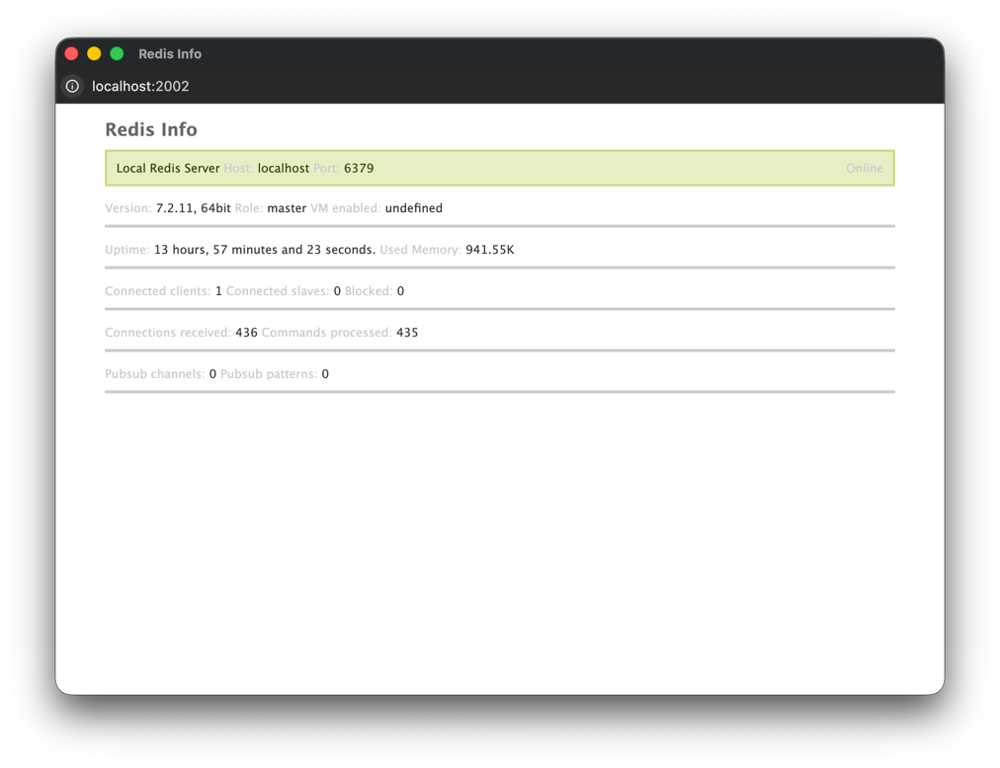

Redis Info
==========

Pure PHP, self-contained Redis monitoring tool.



Redis Info is an easy to configure and use, react-based realtime monitoring tool for Redis servers and clusters,
 written entirely in PHP, with low-dependency in mind.
It provides a simple front-end for access to statistics and server status.

Additionally, a local API is available for use, supporting a `sqlite3`-based status metrics history.

> The project is in still in development, please use with caution.

## Installation

Get the `.phar` archive from the [latest release](https://github.com/machinateur/redis-info/releases).

It needs at least PHP `>=8.2` with `ext-json`, `ext-pcntl` and `ext-sqlite3` installed.

## Configuration

Set up any number of Redis servers using `redis-info.ini` file.

An example configuration file looks like this:

```ini
[Local Redis Server]
host = localhost
port = 6379

;[Server Alias]
;label = Server display label

;# required host and port
;host = redis-server-address
;port = 6379

;# set auth for quick changes
;auth = username password
;# or username/password separately
;password = password
;username = username

;# set refresh interval timer
;interval = 5.0
```

## Usage

```
php -d short_open_tag=1 redis-info -h

Description:
  Pure PHP, self-contained Redis monitoring tool.

Usage:
  redis-info [options]

Options:
  -s, --server[=SERVER]    Local socket server DSN [default: "tcp://127.0.0.1:2002"]
  -c, --config=CONFIG      Ini config file path [default: "redis-info.ini"]
  -m, --monitor=MONITOR    Redis server host and port (DSN) (multiple values allowed)
  -d, --daemon             Run as daemon without the server
  -f, --database=DATABASE  SQLite history database path
  -h, --help               Display help for the given command. When no command is given display help for the redis-info command
      --silent             Do not output any message
  -q, --quiet              Only errors are displayed. All other output is suppressed
  -V, --version            Display this application version
      --ansi|--no-ansi     Force (or disable --no-ansi) ANSI output
  -n, --no-interaction     Do not ask any interactive question
  -e, --env=ENV            The Environment name. [default: "dev"]
      --no-debug           Switches off debug mode.
  -v|vv|vvv, --verbose     Increase the verbosity of messages: 1 for normal output, 2 for more verbose output and 3 for debug
```

## Data

All status data snapshots will be collected in the `redis_info_history` table of the `redis-info-history.sqlite` database.

## License

It's MIT.
